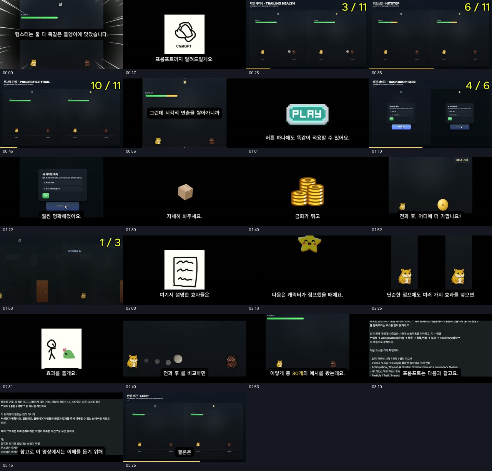

# 영상 분석: 게임 애니메이션 효과 30종

## 분석 범위와 핵심

대상은 웹핵의 [AI로 만든 게임이 아마추어처럼 보이는 진짜 이유](https://www.youtube.com/watch?v=25olpo56QT4), 약 3분 33초 영상이다. 페이지 설명의 챕터, 한국어 자동 자막, 직접 추출한 장면의 효과 제목과 전후 화면을 교차 확인했다. 아래 시간은 효과 카드가 확인되는 대략적인 위치이며 정확한 컷 시작점은 아니다.

영상은 같은 게임 상황에서 시각적 반응을 단계적으로 추가한다. 피해량 계산, 버튼 기능, 보상 지급이 같아도 플레이어가 사건을 알아차리는 방식은 달라진다. 마지막에는 매 타격에 강한 효과를 반복하면 피로해질 수 있으며 상황별 강도 조절이 필요하다고 설명한다. 이는 제작자의 주장과 예시이며, 사용자 실험으로 매출·잔존율 향상을 입증한 자료는 아니다.

## 직접 확인한 효과 목록

### 피격: 11종

근거: [피격 효과 카드 모음](cards-hit.jpg). 햄스터가 투사체에 맞는 동일한 구도를 좌우로 비교한다.

| 번호 | 확인 위치 | 화면에 표시된 효과 | 개발 관점의 의미 |
|---|---|---|---|
| 1 | 00:20 | 선형 보간 · Lerp | 수치·표시 위치의 급격한 변화를 연결 |
| 2 | 00:22 | 피해 예고 바 · Damage Preview | 앞으로 바뀔 체력 영역을 구별 |
| 3 | 00:25 | 지연 체력바 · Trailing Health | 감소 전 체력 흔적을 잠시 보존 |
| 4 | 00:28 | 피격 플래시 · Hit Flash | 맞은 대상의 순간적인 색 변화 |
| 5 | 00:31 | 넉백 · Knockback | 충격 방향을 이동으로 표현 |
| 6 | 00:33 | 히트스톱 · Hitstop | 충돌 순간의 짧은 정지 |
| 7 | 00:36 | 충돌 파티클 · Impact Particle | 접촉 지점 강조 |
| 8 | 00:39 | 화면 흔들림 · Screen Shake | 큰 충격을 카메라에 전달 |
| 9 | 00:42 | 데미지 숫자 · Damage Number | 변화량을 명시 |
| 10 | 00:45 | 투사체 잔상 · Projectile Trail | 이동 궤적과 방향을 남김 |
| 11 | 00:48 | 사전 동작 · Anticipation | 행동 직전의 준비를 보여줌 |

### 버튼·모달: 6종

근거: [UI·보상 카드 모음](cards-ui-reward.jpg). 버튼 입력과 아이템 모달의 등장 과정을 비교한다.

| 번호 | 확인 위치 | 효과 | 개발 관점의 의미 |
|---|---|---|---|
| 12 | 01:03 | 호버 피드백 · Hover | 상호작용 가능한 대상 표시 |
| 13 | 01:04 | 버튼 프레스 · Press State | 누르는 순간의 입력 확인 |
| 14 | 01:07 | 모달 스케일인 · Scale In | 모달 등장에 시작과 끝 부여 |
| 15 | 01:09 | 배경 페이드 · Backdrop Fade | 현재 선택 대상에 시선 집중 |
| 16 | 01:12 | 오버슈트 · Overshoot | 목표 크기를 조금 넘었다가 정착 |
| 17 | 01:14 | 순차 등장 · Stagger | 정보 묶음을 차례대로 노출 |

### 보상: 4종

| 번호 | 확인 위치 | 효과 | 개발 관점의 의미 |
|---|---|---|---|
| 18 | 01:31 | 카운트업 · Count Up | 누적 수치 변화를 읽을 시간 제공 |
| 19 | 01:33 | 픽업 바운스 · Pickup Bounce | 획득 물체의 순간적인 반응 |
| 20 | 01:35 | 반짝임 · Sparkle | 가치 있는 획득물 강조 |
| 21 | 01:37 | HUD로 날아가기 · Fly to HUD | 획득 위치와 자원 표시를 연결 |

### 장면 전환·점프·공격: 9종

근거: [전환·점프·공격 카드 모음](cards-transition-jump-attack.jpg).

| 번호 | 확인 위치 | 효과 | 개발 관점의 의미 |
|---|---|---|---|
| 22 | 01:57 | 페이드 전환 · Fade Transition | 상태 변경 전후를 연결 |
| 23 | 01:58 | 방향성 전환 · Directional Wipe | 이동 방향을 전환 방향에 반영 |
| 24 | 02:01 | 전환 예고 · Transition Anticipation | 장소 변경 직전의 준비 표현 |
| 25 | 02:17 | 찌그러짐과 늘어남 · Squash & Stretch | 움직임에 탄성과 무게 부여 |
| 26 | 02:19 | 착지 반응 · Landing Squash | 바닥 접촉 순간 구별 |
| 27 | 02:21 | 착지 파티클 · Landing Dust | 접촉 위치와 착지 강도 표시 |
| 28 | 02:32 | 카메라 펀치 · Zoom Punch | 중요한 충돌을 잠깐 확대 |
| 29 | 02:34 | 순간 슬로모션 · Hit Slow Motion | 중요한 타격 주변의 시간 강조 |
| 30 | 02:37 | 퇴장 피드백 · Death Feedback | 적이 제거됐다는 결과 전달 |

이 목록은 화면 카드의 11+6+4+3+3+3 구성을 확인한 것이다. 여러 예시에 동일 원리가 재사용되므로 서로 독립적인 엔진 기능 30개를 만들어야 한다는 뜻은 아니다. 예를 들어 모달 오버슈트·픽업 바운스·착지 반응은 트윈 기반의 공통 동작 계층으로 구현할 수 있다.

## 영상에서 관찰한 것과 추론의 경계

- **관찰:** 좌우 전후 비교, 체력바의 여러 색 구간, UI 배경 어두워짐, 모달·보상·장면 전환 예시, 효과명과 번호를 확인했다.
- **설명·자막:** 중요도에 따른 강도 조절, 과도한 반복의 피로, AI로 프로젝트 전체 피드백을 검토하는 방법을 소개한다. 자동 자막에는 오인식 가능성이 있다.
- **개발적 해석:** 사건의 시작·충돌·결과를 분리하고 공통 연출 관리자에서 재사용하면 현재 프로젝트의 유지보수에 유리하다. 이는 이번 조사에서 도출한 제안이다.
- **확인하지 않은 것:** 원본 데모 소스, 엔진 종류, 실제 이징 함수, 프레임별 정지 길이, 사용자 실험 결과. 화면만으로 해당 값을 단정하지 않는다.

## 현재 게임에 대한 결론

ClaudeGame은 이미 피해 숫자·플레이어 피격 흔들림·공격 호·보스 공격 예고 등을 갖고 있다. 다음 개선은 효과 수를 늘리는 작업보다 **맞은 대상 식별 → 체력 변화 → 처치 인식 → 보상 확인**을 연결하는 작업이 적절하다.

추천 순서는 피격 플래시와 지연 체력바, 버튼 프레스, 적 퇴장 동작, 보상 표시 연결이다. 강한 카메라 확대·전역 히트스톱은 반복 전투에서 피로와 시간 처리 문제를 일으킬 수 있으므로 이후 선택적으로 검토한다. 점프 기능이 없는 현재 게임에 영상 재현만을 목적으로 점프 시스템을 추가할 필요는 없다.

구체적인 소스 근거, Phaser 구현 설계, 성능·접근성·시각 검증 기준은 [개발 심층 리서치](game-development-research.md)에 정리했다.
