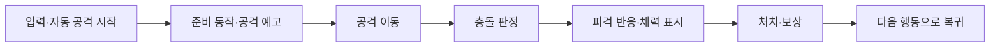

# 게임 애니메이션 개발 심층 리서치

작성 2026-10-05. ClaudeGame / Phaser 3.90.0 기준. 아래 구조와 수치는 **구현 제안**이며 이번 조사에서 게임에 적용하지 않았다. 타이밍은 영상에서 측정한 값이나 보편적인 표준이 아닌 첫 조정값이다.

## 1. 개발 방향: 사건을 읽을 수 있게 만들기

Game Feel 연구는 조작·물리 특성, 반응의 강조, 플레이를 돕는 요소를 함께 다룬다. 애니메이션만 추가한다고 조작감 전체가 해결되지는 않는다. 이 논문은 문헌 조사이며 특정 효과의 매출·잔존율 개선을 검증한 실험은 아니다. [Pichlmair·Johansen, Designing Game Feel. A Survey](https://arxiv.org/abs/2011.09201)

GDC의 *Juice It or Lose It*은 단순한 게임의 반응을 풍부하게 하는 사례를 다루고, *Game Feel: Why Your Death Animation Sucks*는 사망 연출의 세부 조정을 주제로 한다. 이번 조사에서는 공식 발표 소개를 참고했으며 두 강연 전체를 시청한 것으로 간주하지 않았다. [GDC: Juice It or Lose It](https://www.gdcvault.com/play/1016789/Juice-It-or-Lose), [GDC: Game Feel](https://www.gdcvault.com/play/1022759/Game-Feel-Why-Your-Death)

현재 게임의 평가 단위는 개별 이펙트보다 다음 사건 사슬이 적합하다.



피드백은 사건의 원인을 설명해야 한다. 명중하지 않은 공격에 피격 반짝임을 내거나, 보상이 실제 반영되기 전에 표시만 증가시키면 잘못된 정보를 전달한다. 보상 데이터는 한 번만 확정하고 애니메이션은 확정 결과를 표현한다.

## 2. 기술 선택

| 수단 | 적합한 효과 | 현재 프로젝트 선택 |
|---|---|---|
| 스프라이트 프레임 | 걷기·공격 자세·사망 형태 | 아트 확장 단계에 도입 |
| Tween | 크기·투명도·시각적 반동·카운트업 | 우선 사용 |
| 파티클 | 충돌 조각·먼지·희귀 보상 | 공유 이미터와 개수 제한 |
| 카메라 효과 | 큰 피격·보스 처치 | 낮은 빈도, 별도 설정 |
| DOM/CSS | 버튼·모달·HUD | 기존 UI 구조 유지 |
| 셰이더·후처리 | 발광·왜곡·전체 화면 표현 | 모바일 측정 후 선택 |

Phaser의 프레임 애니메이션은 텍스처 프레임을 순서대로 재생하고, Tween은 수치 속성을 시간에 따라 변경한다. 현재 정적 픽셀 텍스처에도 Tween을 적용할 수 있다. 걷는 자세 자체를 표현하려면 별도 프레임 아트가 필요하다. [Phaser Animations](https://docs.phaser.io/phaser/concepts/animations), [Phaser Tweens](https://docs.phaser.io/phaser/concepts/tweens)

주의: 최신 문서의 기본 API 버전과 프로젝트 버전이 다를 수 있다. 실제 구현 시 [TweenManager 3.90.0](https://docs.phaser.io/api-documentation/3.90.0/class/tweens-tweenmanager), [Camera 3.90.0](https://docs.phaser.io/api-documentation/3.90.0/class/cameras-scene2d-camera), [ParticleEmitter 3.90.0](https://docs.phaser.io/api-documentation/3.90.0/class/gameobjects-particles-particleemitter)를 기준으로 확인한다.

## 3. 현재 소스와 개선 우선순위

다음은 로컬 소스 정적 검토 결과다. 이번 연구에서 새 게임 플레이의 시각 합격 판정을 수행한 것은 아니다.

| 영역 / 근거 | 확인된 구현 | 추가할 항목 | 우선순위·난도 |
|---|---|---|---|
| [art.js](../../../src/scenes/art.js) | 정적 픽셀 텍스처, 800ms 피해 문자 이동·소멸 | 문자 개수 제한·합산, 프레임 아트 | P1·중 / 아트는 P2 |
| [IdleScene.js](../../../src/scenes/IdleScene.js) | 상하 흔들림, 방향 전환, 공격 호, 오라·저주 표시 | 준비·타격·복귀 자세의 분리 | P1·중 |
| [CombatScene.js](../../../src/scenes/CombatScene.js) | hit에 피해 숫자, hurt에 80ms/0.003 카메라 흔들림 | 맞은 적 플래시·시각 반동 | P0·중 |
| 같은 CombatScene | 무적 중 플레이어 투명도 점멸 | 무적 표시와 단발 피격 강조 구분 | P0·낮음 |
| 같은 CombatScene | 제거된 적 스프라이트 즉시 삭제 | 충돌 판정에서 분리된 사망 잔상 | P1·중 |
| 같은 CombatScene | 보스 패턴 예고, 종료 후 즉시 장면 이동 | 마지막 타격→퇴장→결과 순서 | P1·중 |
| [main.js](../../../src/main.js) | 수치 즉시 반영, 모달 즉시 표시, 획득 알림 | 표시 수치 보간·선택적 획득 연출 | P1·중 |
| [style.css](../../../src/style.css) | hover·focus·disabled, 체력 폭 전환 | press·모달 진입·지연 체력 레이어 | P0·낮음~중 |
| 같은 style.css | CSS reduced-motion 처리 | Canvas·카메라에도 설정 연결 | P0·중 |
| [audio.js](../../../src/audio.js) | 사용자 입력 후 오디오 활성화, 간단한 효과음 | 동시 발음·반복 빈도 제한 | P1·낮음 |
| [arena.js](../../../src/systems/arena.js) | hit·hurt·kill 사건 전달 | 대상 ID·방향·중요도 포함 | P0·중 |

P0는 연출을 안전하게 붙이기 위한 기반과 명확성, P1은 사건의 연결, P2는 선택적 고급 연출이다. 기존 게임 설계 기능의 완료 여부와 이번 추가 연출 제안의 완료 여부는 별개다.

## 4. 권장 구현 구조

### 판정과 표시를 분리

현재 이벤트는 좌표·피해량 중심이다. 안정적인 대상 식별을 위해 아래와 같은 사건 계약을 제안한다. 이름은 설계 예시다.

```js
// 판정이 확정된 뒤 한 번 발행하는 순수 데이터
{
  type: 'hit', eventId: 1204, attackId: 81,
  targetId: 'enemy-27', sourceId: 'player',
  x: 120, y: 240, direction: { x: 1, y: 0 },
  damage: 18, critical: false, fatal: false,
  importance: 'normal'
}
```

`CombatScene`은 사건을 `CombatPresentation`에 전달하고, 이 관리자는 설정과 효과 예산을 적용한다. 개별 적마다 전역 리스너·이미터를 만드는 방식은 피한다. 장면 종료 때 예약 타이머·트윈·리스너를 정리하고, 이미 제거된 대상의 늦은 콜백은 무시한다. Scene의 시간·트윈 등은 장면 수명과 함께 관리되므로 종료 경로를 명시해야 한다. [Phaser Scenes](https://docs.phaser.io/phaser/concepts/scenes)

### 위치와 애니메이션 속성의 소유권

```text
entityRoot      ← 매 프레임 모델 좌표를 적용
  visualRoot    ← 반동·찌그러짐·일시적 시각 오프셋
    bodySprite  ← 프레임·색상·방향
  shadow        ← 바닥 기준 위치 유지
```

모델 동기화와 트윈이 같은 `sprite.x`, `scale`을 동시에 쓰면 떨림·원위치 복귀 실패가 생긴다. 기본 이동과 연출 오프셋을 분리한다. 피격 종료 때 `clearTint()`를 무조건 호출하면 기존 정예 색상을 잃을 수 있으므로 기본 색 상태를 복원한다. 반복 피격은 기존 플래시를 갱신하고 무제한 트윈을 중첩하지 않는다.

실제 넉백은 충돌·위치·난도를 바꾸는 게임 규칙이다. 시각 반동은 자식 오프셋만 잠깐 이동한다. 영상의 넉백을 재현할 때 어느 쪽인지 먼저 구분하고, 현재 게임에는 시각 반동을 먼저 적용하는 편이 변경 범위가 작다.

### 처치와 보상

적은 체력이 0이 되면 즉시 판정 대상에서 제거한다. 표시 관리자가 마지막 텍스처·좌표를 복사한 사망 효과를 소유한다. 보상 저장을 사망 트윈의 완료 콜백에 묶지 않는다. 사용자가 장면을 닫거나 효과를 건너뛰어도 보상은 보존되어야 한다.

보스 결과는 `전투 종료 확정 → 짧은 퇴장 연출 → 결과 표시` 상태로 분리한다. 전투 종료 확정 뒤 추가 공격·보상 중복은 차단한다. 장면 이동·재시작·탭 전환 중에도 종료 처리가 한 번만 실행되도록 ID 또는 종료 상태를 사용한다.

## 5. 효과별 개발 방법과 초기 조정값

| 효과 | 첫 조정안 | 실패 방지 |
|---|---|---|
| 적 피격 플래시 | 40~70ms, 대상만 밝게 | 기본 색상 복원, 연속 피격 갱신 |
| 시각 반동 | 2~4px, 80~130ms 복귀 | 충돌 위치와 분리 |
| 지연 체력바 | 실제 바 즉시 갱신, 뒤쪽 바 150ms 뒤 300ms 이동 | 연속 피해·회복 시 목표 재계산 |
| 버튼 프레스 | scale 0.96, 70~100ms / 복귀 100~140ms | pointercancel·키보드·disabled 처리 |
| 모달 등장 | 0.96→1, 120~180ms | 포커스 이동·닫기·재열기 정상 동작 |
| 일반 적 퇴장 | 160~240ms 축소·소멸 | 판정 제거와 별도 |
| 보상 카운트업 | 200~400ms | 실제 자원과 표시값 분리 |
| HUD 이동 | 묶음당 대표 아이콘 3~5개 | 숫자는 실제 총합, 화면 크기 변경 대응 |
| 투사체 잔상 | 일정 이동 거리마다 생성 | FPS 의존 생성 방지, 동시 개수 제한 |
| 큰 타격 히트스톱 | 선택적 30~60ms | 매 평타 적용 금지, 재발동 제한 |
| 보스 마무리 | 총 500~900ms 내 짧은 순서 | 건너뛰기·reduced-motion 지원 |

이 값들은 모바일·픽셀 크기·공격 빈도에 따라 조정한다. 한 번의 타격이 멋진 것보다 60초간 반복해도 체력·위험 지역·입력 반응이 읽히는 것이 중요하다.

### 보간과 이징

고정 비율 `value += (target - value) * 0.1`을 매 프레임 적용하면 프레임률에 따라 속도가 달라진다. 지속시간이 있는 UI는 Tween으로, 지속적으로 목표를 따라가는 표시는 `a = 1 - exp(-k * dt)` 형태의 시간 기반 보간으로 구현할 수 있다. 이 식은 제안이며 영상의 실제 구현식을 확인한 것은 아니다.

물리·공격 쿨다운·화면 표시의 시간은 동일하게 느리게 만들지 않는다. 고정 스텝과 누적 시간 처리에는 과도한 따라잡기 계산을 방지할 상한이 필요하다. [Glenn Fiedler, Fix Your Timestep!](https://gafferongames.com/post/fix_your_timestep/)

### 히트스톱과 슬로모션

먼저 공격자·피격자 표시만 잠깐 멈추는 국소 효과를 권장한다. 전역 히트스톱을 넣는다면 `realDt`, `simulationDt`, `presentationDt`의 정책을 별도로 정해야 한다. 생존 제한시간·오프라인 보상·저장 시각까지 무심코 느려지게 하지 않는다.

`scene.pause()` 후 같은 장면의 `delayedCall()`로 재개하려 하면 정지한 시계에 재개를 맡기는 문제가 생긴다. 전체 Scene을 정지시키는 대신 자체 전투 업데이트의 진행량을 조절하고 UI·복귀 시계는 계속 진행시키는 구조가 필요하다. 연속 타격으로 정지 시간이 무한 연장되지 않도록 총량과 재발동 간격을 제한한다.

### 카메라

GDC의 카메라 발표는 충격량을 누적한 뒤 감소시키고, 흔들림 강도를 그 제곱·세제곱으로 매핑하는 방식을 제시한다. 기본 카메라 위치에 오프셋을 합성하고 부드러운 노이즈를 사용하는 설명도 포함한다. [Squirrel Eiserloh, Juicing Your Cameras with Math, 슬라이드 10·14·16~17](https://media.gdcvault.com/gdc2016/Presentations/Eiserloh_Squirrel_JuicingYourCameras.pdf)

프로젝트에서는 처음부터 별도 노이즈 시스템을 만들기보다 기존 Phaser shake에 중요도별 상한·쿨다운을 붙인다. HUD는 현재처럼 DOM에 두어 흔들리지 않게 한다. 확대는 조준·보스 위험 영역을 가리지 않아야 한다. 카메라 효과는 표시 변환이며 실제 월드 좌표를 변경하는 처리와 분리한다. [Phaser Camera 3.90](https://docs.phaser.io/api-documentation/3.90.0/class/cameras-scene2d-camera)

### 파티클과 문자

아래는 Phaser 3.90용 API 형태 예시다. `impact-dot` 텍스처 생성, 장면 수명 정리, 효과 예산 검사는 별도 구현이 필요하며 실행 검증된 프로젝트 패치는 아니다.

```js
const impact = scene.add.particles(0, 0, 'impact-dot', {
  emitting: false,
  lifespan: 180,
  speed: { min: 25, max: 70 },
  scale: { start: 1, end: 0 },
  alpha: { start: 1, end: 0 },
  maxParticles: 96,
  maxAliveParticles: 48
});
// 사건별 예산 검사 후 호출
impact.explode(5, hit.x, hit.y);
```

`maxParticles`는 총 풀 용량, `maxAliveParticles`는 동시에 살아 있는 입자 수를 제한한다. 모든 충돌마다 이미터를 새로 만들지 말고 공유한다. [Phaser ParticleEmitter 3.90](https://docs.phaser.io/api-documentation/3.90.0/class/gameobjects-particles-particleemitter)

피해 문자는 초당 수십 개의 Text 생성·삭제로 비용이 늘 수 있다. 같은 대상의 짧은 구간 피해를 합치고 중요하지 않은 숫자는 제한한다. 풀을 도입할 경우 반환 때 투명도·크기·색·트윈·활성 상태를 모두 초기화한다.

### UI·보상 좌표·음향

현재 BottomPanel은 DOM 내용을 갱신하므로 모든 렌더마다 항목 등장 애니메이션을 재시작하면 안 된다. 안정적인 항목 ID와 이전 상태를 비교해 새 항목만 움직인다. HUD로 이동하는 아이콘은 Canvas 월드 좌표를 카메라·캔버스 표시 크기를 거쳐 CSS 좌표로 변환한다. iframe 내부 좌표계와 브라우저 확대도 검증한다.

오디오는 사용자 동작 뒤 활성화하는 기존 방식을 유지한다. 브라우저는 자동 재생을 제한할 수 있다. 피격음은 짧은 구간에 합치고 최대 동시 발음 수를 둔다. 음소거 상태에서도 시각 정보만으로 주요 사건을 이해할 수 있어야 한다. [MDN Web Audio best practices](https://developer.mozilla.org/en-US/docs/Web/API/Web_Audio_API/Best_practices), [MDN Autoplay](https://developer.mozilla.org/en-US/docs/Web/Media/Guides/Autoplay)

## 6. 접근성과 성능

`prefers-reduced-motion`은 운영체제의 동작 감소 선호를 감지한다. CSS 규칙만으로 Phaser Canvas 내부 카메라·트윈이 중단되지는 않으므로 `matchMedia` 결과와 변경 이벤트를 게임 설정에 연결한다. [MDN prefers-reduced-motion](https://developer.mozilla.org/en-US/docs/Web/CSS/Reference/At-rules/@media/prefers-reduced-motion)

권장 설정은 일반·약하게·끄기다. 줄인 모드에서는 흔들림·확대·긴 비행·오버슈트를 제거하고, 필수 체력 수치·위험 구역·처치 결과는 유지한다. W3C의 상호작용 애니메이션 비활성화 기준은 WCAG 2.2의 AAA 기준이며 모든 게임 움직임을 일괄 금지한다는 뜻은 아니다. [W3C SC 2.3.3](https://www.w3.org/WAI/WCAG22/Understanding/animation-from-interactions.html)

전체 화면을 반복적으로 밝게 번쩍이게 하는 연출은 피한다. W3C G19는 1초 내 번쩍임을 3회 이하로 제한하는 방법을 설명한다. 작은 대상의 색 변화까지 단순 횟수만으로 동일 판정할 수는 없으며 면적·명암 등도 고려해야 한다. [W3C G19](https://www.w3.org/WAI/WCAG21/Techniques/general/G19)

**프로젝트 측정 목표 제안:** 데스크톱 60fps 기준 전체 프레임 예산 약 16.7ms. 모바일은 실제 장치에서 별도 측정한다. 초기 상한은 파티클 48개, 피해 문자 24개, 보상 비행 아이콘 5개로 시작하고 프로파일 결과에 따라 조정한다. 이는 측정된 현재 성능이나 엔진 한계가 아니다.

프레임 시간 p50/p95, 활성 효과 수, 트윈·타이머 수, 10분 전투 후 메모리 추세를 기록한다. 성능 저하 시 장식 입자와 잔상부터 줄이고 위험 표시·입력 확인은 보존한다.

## 7. 구현·시각 검증 순서

1. **기반:** 사건 ID·대상 ID, 표시 관리자, 설정·중복 제한·수명 정리. 효과를 껐을 때 전투 결과가 동일한지 확인.
2. **명확성:** 적 피격 플래시·시각 반동·지연 체력바·버튼 프레스. 1회 타격과 연속 타격 비교.
3. **결과 전달:** 적 퇴장·보상 카운트업·HUD 연결·보스 종료 순서. 중도 이동에도 보상 중복·손실이 없는지 확인.
4. **선택 효과:** 잔상·소수 파티클·중요 타격 한정 카메라·히트스톱. 장시간 반복 피로와 성능 측정.
5. **아트:** 걷기·공격·사망 프레임. 현재 단일 텍스처의 시각 방향과 맞는 소형 시트부터 제작.

| 검증 상황 | 시각·기능 합격 기준 |
|---|---|
| 일반 공격 1회 | 맞은 대상과 피해 위치가 일치, 색·스케일 원복 |
| 같은 대상 연속 타격 | 플래시 고착·문자 폭주·반동 누적 없음 |
| 다수 적 동시 처치 | 위험 표시를 가리지 않음, 보상 정확히 한 번 |
| 보스 마지막 타격 | 퇴장 인식 후 결과 표시, 추가 공격 차단 |
| 회복 중 재피격 | 실제·지연 체력바 순서가 맞고 음수 폭 없음 |
| 모달 연타·닫기·재열기 | 중복 실행 없음, 포커스 복원, 입력 누락 없음 |
| 터치·키보드·포인터 취소 | 버튼 눌림 상태 고착 없음 |
| 모바일·포털 iframe·크기 변경 | 보상 아이콘이 실제 HUD 위치에 도착 |
| 동작 감소·음소거 | 필수 정보 유지, 카메라 강제 움직임 제거 |
| 탭 전환·장면 재시작 | 정지·슬로모션 복귀, 오래된 콜백 없음 |
| 10분 반복 전투 | 효과 개수 안정, 메모리 증가·프레임 악화 원인 없음 |

Playwright에서는 고정 시드·동일 저장 상태로 전후를 비교하고, 사건 직전/직후/복귀 시점 스크린샷과 짧은 녹화를 함께 남긴다. 정지 화면만으로 히트스톱이나 타격감을 합격 처리하지 않는다. 기능 테스트는 보상 단일 지급·장면 종료 취소·이벤트 중복 처리 등 실제 오류 가능성이 있는 부분에 집중한다.

## 8. 이 프로젝트에 사용할 독자적인 검토 요청문

아래는 원 영상의 프롬프트를 복제한 것이 아니라 이번 소스 조사에 맞춰 작성한 요청문이다.

> ClaudeGame의 판정과 저장 규칙을 보존하면서 전투 사건의 표시 경로를 점검한다. 각 효과에 대해 발생 사건, 대상 ID, 표시 시작·종료, 중복 발생 정책, 장면 종료 정리, 동작 감소 대안을 표로 작성한다. 현재 코드 근거와 미구현 제안을 구분한다. 피격 대상 식별, 체력 변화, 처치 인식, 보상 확인 순으로 우선순위를 정한다. 일반 타격에 강한 카메라 효과를 반복하지 않는다. 구현 후 동일 조건의 짧은 녹화와 기능 검증으로 결과를 확인하고, 통과하지 않은 항목을 완료로 표시하지 않는다.

## 9. 조사 한계

영상은 전체 파일을 확보하고 장면을 추출했지만 모든 프레임의 동작 길이를 계측하지 않았다. GDC 카메라 자료는 슬라이드를 읽었고 다른 GDC 자료는 공식 소개를 참고했다. 외부 연구는 기술 선택의 근거이며 이 게임 사용자에게 같은 효과가 나타난다는 보장은 아니다. 현재 소스의 연출 차이는 정적 조사 결과이며 구현 후에는 실제 기기 녹화·입력·성능 검증이 필요하다.
