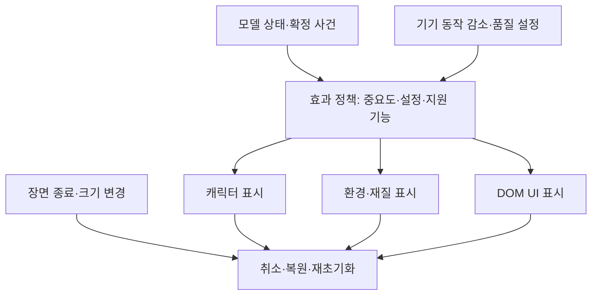

# 추가 효과 개발 설계·기술 비교

2026-10-05 · Phaser 3.90.0 · 연구 제안. 코드는 개념 예시이며 게임에 적용·실행 검증한 패치가 아니다.

## 1. 현재 게임에서 먼저 적용할 후보

| 순서 | 후보 | 선택 이유 | 선행 작업 | 합격 조건 |
|---|---|---|---|---|
| 1 | A24 장비 재배치 | 가방·장착 슬롯 사이의 변화를 설명 | 안정적인 item ID, DOM 갱신 전후 측정 | 같은 아이템의 시작·도착이 일치, 포커스 유지 |
| 2 | A14 다층 패럴랙스 | 전투 규칙 수정 없이 방치 공간의 깊이 보완 | 배경 2~3층 아트 분리 | 반복 이음매·빈 공간 없음, HUD 고정 |
| 3 | A19 팔레트 순환 | 현재 픽셀 스타일과 직접 결합 | 대상별 전용 팔레트 또는 프레임 | 위험색·장비 등급색 오염 없음 |
| 4 | A04 보스 시선 추적 | 보스가 누구를 보고 있는지 표시 | 머리·눈 분리, 회전 제한 | 모델 목표와 일치, 급회전·관절 뒤집힘 없음 |
| 5 | A01 소품 후속 동작 | 정적 캐릭터에 작은 무게감 추가 | 소품 분리와 피벗 | 이동 종료·재시작·텔레포트 후 안정 |
| 6 | A11 표면 흐름 | 기존 봉인·오라의 지속 상태 구분 | 이음매 없는 반복 무늬 | 시전자 위치·상태 종료와 동기화 |

모두 구현해야 하는 필수 요구사항으로 해석하지 않는다. A05 접지 IK, A16 물, A18 파괴, A22 큰 맵 카메라, A23 능동 스킬 쿨다운은 해당 게임 규칙·아트가 생긴 뒤 검토하는 편이 타당하다.

현재 `src/systems/presentation.js`에는 움직임 설정 판정·처치 잔상·보상 이동·지연 체력 표시가 있다. 이를 효과를 무한 추가하는 단일 파일로 키우기보다 `CharacterMotion`, `EnvironmentMotion`, `MaterialEffects`, `UITransitions`로 책임을 나눌 수 있다. 이 모듈 이름은 제안이며 아직 존재하는 파일이 아니다.

## 2. 효과와 구별할 6가지 구현 기법

### T01. 트랙·부품별 동작 합성

이동, 상체 조준, 호흡, 소품 움직임을 독립적으로 합성한다. Spine의 AnimationState는 여러 트랙과 애니메이션 혼합을 제공한다. 다만 '상위 트랙 덮어쓰기'와 '기본 자세에 차이를 더하는 가산 합성'은 같은 연산이 아니다. [Spine Applying Animations](https://esotericsoftware.com/spine-applying-animations)

Phaser의 현재 단일 텍스처에 자동으로 뼈 레이어가 생기지는 않는다. 픽셀 아트를 부품으로 나누거나 방향별 프레임을 제작해야 한다. 코드 계층 예시는 다음과 같다.

```text
modelRoot: 모델의 실제 월드 좌표
  facingRoot: 좌우 방향·제한된 방향 전환
    poseRoot: 걷기·호흡·공격 자세
      body
      aimRoot: 머리·무기 목표 추적
      accessoryRoot: 소품 후속 움직임
  groundShadow: 지면 기준
```

각 transform 속성에는 최종 작성자를 하나만 둔다. 자동 위치 동기화와 Tween이 같은 좌표를 덮어쓰지 않게 한다.

### T02. 감쇠 스프링

목표값에 복원력과 감쇠를 적용해 목표가 바뀌어도 자연스럽게 따라가도록 한다. A01 소품, A03 기울기, V07 탄성 UI에 공유할 수 있다. Spine의 물리 제약도 복원·감쇠·관성 제어를 제공하지만 아래 식은 Spine 내부 구현의 복제가 아닌 임계 감쇠 스프링의 독립 예시다. [Spine Physics constraints](https://us.esotericsoftware.com/spine-physics-constraints)

```js
// dt: 초. 이 한 스텝 동안 target이 일정하다는 가정.
// x/v는 시각 상태이며 게임 판정에 쓰지 않는다.
function criticalSpring(x, v, target, omega, dt) {
  const y = x - target;
  const j = v + omega * y;
  const decay = Math.exp(-omega * dt);
  return {
    x: target + (y + j * dt) * decay,
    v: (v - omega * j * dt) * decay,
  };
}
```

각도는 ±π 경계에서 최단 방향으로 정규화해야 한다. 탭 복귀·텔레포트에서는 오래된 속도를 0으로 초기화하고 목표에 맞춘다. 동작 감소 모드에서도 같은 초기화 규칙을 쓴다. 임계 감쇠는 과도한 진동을 피하는 선택이며 탄성 바운스가 필요하면 다른 감쇠비를 설계해야 한다.

### T03. IK·제약식

끝부분을 목표에 맞추기 위해 관절을 계산한다. A04 조준과 A05 접지에 적합하다. 2개 뼈의 길이가 허용하는 영역 밖의 목표에는 도달 한계·굽힘 방향·FK/IK 전환 정책이 필요하다. [Spine IK constraints](https://en.esotericsoftware.com/spine-ik-constraints)

현재 작은 캐릭터는 먼저 1개 관절 look-at 또는 4~8방향 프레임으로 해결하는 편이 단순하다. 정교한 리그 도입은 아트 제작·런타임 통합 비용까지 비교해야 한다.

### T04. 관성 전이 — Inertialization

이전 동작과 새 동작의 자세·속도 차이가 부드럽게 사라지도록 전이한다. Gears of War의 GDC 발표는 이전/새 애니메이션을 전이 내내 함께 평가하는 방식의 비용과 대안, 초기 속도 및 가속도 처리를 다룬다. 단순 Lerp나 임의의 spring과 동일한 알고리즘은 아니다. [David Bollo, Inertialization, PDF](https://media.gdcvault.com/gdc2018/presentations/bollo_david_inertialization_high_performance.pdf)

현재 프로젝트에 원본 3D 관성 전이를 도입할 이유는 약하다. 걷기→공격→대기의 아트가 충분히 늘고 전환 단절이 실제로 관찰될 때 검토한다. 발표의 성능 개선을 현재 게임의 예상 개선율로 옮겨 적지 않는다.

### T05. 거리 기반 재생 — Distance matching

시간만으로 재생 위치를 정하지 않고 이동 거리·남은 거리를 곡선과 연결한다. Unreal의 공식 예시는 거리 변수로 애니메이션 포즈를 선택한다. [Epic Distance Matching](https://dev.epicgames.com/documentation/en-us/unreal-engine/distance-matching-in-unreal-engine)

현재 게임의 단순화된 응용은 `이동 거리 누적 / 보폭`으로 걷기 프레임 위상을 정하는 것이다. 정지 상태에서 발만 계속 움직이는 현상을 줄일 수 있다. 이는 원본 Unreal 기능을 이식한 완전한 distance-matching 시스템이 아니라 그 원리의 제한된 활용이다.

### T06. 목표 정렬 — Motion warping

준비된 이동 애니메이션의 루트 궤적을 특정 구간 동안 조정해 목표 위치·방향에 맞춘다. 거리 기반 재생이 '어느 포즈를 재생할지'에 관한 것이라면, 이 기법은 '동작이 어디에 도착할지'를 조정한다. [Epic Motion Warping](https://dev.epicgames.com/documentation/unreal-engine/motion-warping-in-unreal-engine?lang=en-US)

작은 자동 전투에서 시각적 손 접촉을 맞추기 위해 실제 캐릭터를 순간 이동시키면 사거리·회피 규칙이 달라진다. 현재 게임에서는 표시용 팔·무기 오프셋을 제한 조정하는 수준이 우선이다. 처형·등반·상호작용 애니메이션이 생길 때 전체 기능을 검토한다.

## 3. Phaser 3.90 구현 경로와 대체 표현

| 후보 | 주 수단 | 제약·대안 |
|---|---|---|
| A01~A07 캐릭터 | Sprite 프레임, Container, 회전·속성 합성 | 리그·프레임 아트 필요; 스프링만으로 그림의 자세가 생기지 않음 |
| A08 연결선 | Graphics / Rope | Rope는 WebGL 전용; Canvas에서는 Graphics 다중 선 |
| A09 궤도 | sin/cos 위치, depth | 충돌 판정은 별도 모델 |
| A10 흔적 | 제한된 Sprite 풀 / RenderTexture | 누적 텍스처의 크기·초기화·복구 비용 관리 |
| A11·A14·A17 | TileSprite, 층별 오프셋 | 투명 레이어의 화면 점유율에 주의 |
| A12 외곽 강조 | 복사 실루엣 / Glow | 내장 FX는 WebGL 전용 |
| A13 광원 | 간이 불빛 이미지 / PointLight / Light2D | 각각의 의미가 다름; 실제 가림 그림자를 자동 제공한다고 가정하지 않음 |
| A16 물 | 프레임 / 변위 셰이더 | 단순 Displacement 하나가 완전한 반사·유체 해석은 아님 |
| A19 팔레트 | 프레임 교체 / 인덱스 텍스처 셰이더 | hue 회전은 팔레트 인덱스 순환과 다름 |
| A20·A21 | ColorMatrix / Bokeh | 효과를 지원하지 않으면 원본 표시 유지 |
| A22 카메라 | startFollow, setDeadzone, follow offset | bob이 아닌 모델 좌표 추적 |
| A23 시간 표시 | Graphics arc / CSS conic-gradient | 숫자·텍스트 접근성 정보 별도 |
| A24 재배치 | FLIP / Web Animations / View Transition | DOM 정체성·포커스·빠른 재입력 관리 |

Rope와 내장 FX의 WebGL 제한은 [Rope 3.90](https://docs.phaser.io/api-documentation/3.90.0/class/gameobjects-rope), [FX 문서](https://docs.phaser.io/phaser/concepts/fx) 및 로컬 `node_modules/phaser/src/gameobjects/rope/Rope.js`, `components/FX.js`에서 확인했다. `TileSprite#tilePositionX`, `Camera#startFollow`, `Camera#setDeadzone`도 로컬 소스에서 존재를 확인했다.

`Phaser.AUTO`는 장치에 따라 Canvas로 동작할 수 있다. 렌더러와 지원 API를 확인한 뒤 고급 효과를 생성하고, 핵심 플레이 정보는 대체 표현에서도 동일하게 유지한다. Phaser 4의 새 필터 API를 3.90 코드에 그대로 붙이지 않는다.

## 4. 추천 효과의 구체적인 설계

### A14: 층별 시차

배경의 직접 표시 위치를 권위 있는 게임 모델과 분리한다. 초기 실험값으로 원경 0.15, 중경 0.35, 근경 0.65 배율을 비교할 수 있다. 이는 추천 시작값이며 문헌의 정답이나 측정값이 아니다.

```js
// worldTravel은 게임 진행의 누적 이동 거리.
// 각 레이어는 미리 생성한 TileSprite라고 가정한다.
for (const layer of layers) {
  layer.sprite.tilePositionX = reducedMotion ? 0 : worldTravel * layer.ratio;
}
```

현재 `IdleScene`은 방을 한 덩어리로 이동한다. `drawRoom()`의 바닥·벽·횃불을 분리할 때 resize가 장면 객체와 트윈을 재생성하는 경로도 함께 정리해야 한다. 이동 방향이 바뀌는 지점의 끊김, 배경 반복 경계, 화면 가로 전환을 녹화로 검증한다.

### A24: 장비 정렬·장착

현재 관리 패널은 변경 시 HTML을 갱신한다. 기존 노드가 사라지면 자연스러운 재배치와 포커스 유지가 어렵다. `item.id`를 DOM 식별자로 두고 변경 전후 사각형을 기록한다. 같은 ID의 복사 아이콘을 transform으로 이동시키고 완료 뒤 제거한다. 상태·장착 판정은 시작 시 확정하며 애니메이션 콜백에 보상·장비 변경을 맡기지 않는다.

FLIP의 측정은 읽기→쓰기→읽기를 항목마다 반복하지 말고 전체 목록 단위로 모아 레이아웃 계산을 줄인다. 빠른 재정렬은 현재 화면 위치에서 새 목표로 연결하거나 기존 효과를 취소한다. [FLIP 원문](https://aerotwist.com/blog/flip-your-animations/)

View Transition API도 UI 상태 전환에 사용할 수 있지만 지원 여부와 환경을 확인하고 즉시 전환 대안을 유지해야 한다. 새 라이브러리를 도입할 필요가 있는지는 현재 DOM 구조와 함께 판단한다. [MDN View Transition API](https://developer.mozilla.org/en-US/docs/Web/API/View_Transition_API)

### A19: 팔레트 순환

팔레트 인덱스와 색 테이블을 분리하거나 색이 바뀐 프레임을 미리 만든다. 물결·룬만 별도 텍스처로 두고 캐릭터의 등급색과 섞지 않는다. 처음에는 4개 프레임을 초당 4~8회 교체하는 간단한 비교안을 만들 수 있다. 해당 수치는 원본 Canvas Cycle의 측정값이 아니다.

밝기가 크게 변하는 팔레트를 빠르게 순환하면 점멸처럼 보인다. 밝기는 가급적 유지하고 색 이동만 시험한다. 픽셀 수가 적은 장식 하나를 위해 전체 화면 후처리를 적용하지 않는다.

### A04·A01: 보스 시선과 소품

목표 각도를 모델 좌표로 계산하고 표시용 머리의 허용 범위에 제한한다. 소품은 머리·몸의 목표 자세와 별도 스프링 상태를 가진다. 매 프레임 기본 자세를 다시 계산한 뒤 소품 오프셋을 합성한다. 이전 프레임의 완성 자세에 오프셋을 다시 더하면 위치가 누적된다.

리사이즈·장면 재입장·스킨 교체에서 `x/v/angle`을 초기화한다. 작은 아트에서는 연속 회전 버전과 방향 프레임 버전을 나란히 비교해 픽셀 선명도가 좋은 쪽을 택한다.

## 5. 실행 구조와 효과 예산



정적인 효과 ID만 관리하지 말고 대상 ID, 시작 사건, 종료 조건, 취소 핸들, 기본 상태 복원값을 함께 보관한다. 프레임·타이머 콜백이 제거된 개체를 참조하지 않도록 한다.

비용은 개수만으로 판단하지 않는다. 화면 전체를 덮는 반투명 레이어 여러 장은 작은 불빛 여러 개보다 비쌀 수 있다. 셰이더 패스 수, 커버하는 픽셀 수, 텍스처 교체, DOM 레이아웃, 객체 생성 수를 함께 측정한다.

**초기 실험 예산:** 시차 3층, 안개 1층, 지속 연결 2개, 간이 광원 2개, 흔적 32개, 재배치 복사 UI 8개부터 비교한다. 현재 기기에서 측정된 안전 상한이 아니라 과도한 초기 설계를 막는 실험 조건이다. 60fps의 전체 프레임 시간은 약 16.7ms이므로 효과가 사용할 여유는 실제 기존 프레임 비용을 뺀 값이다.

## 6. 접근성·시각 검증

기존 `motionEnabled()`에 연결해 새 효과도 사용자 설정과 운영체제 동작 감소 선호를 따른다. 비필수 카메라 이동·다층 시차·궤도·안개 흐름은 정적 표현으로 바꾸고, 쿨다운 숫자·타겟 식별 등 필요한 정보는 남긴다.

길게 자동 실행되는 장식 애니메이션은 멈출 수 있어야 한다. W3C SC 2.2.2는 조건에 해당하는 자동 움직임·업데이트의 정지·숨김 등을 다룬다. 모든 필수 게임 움직임을 일괄 제거하라는 뜻으로 해석하지 않는다. [W3C Pause, Stop, Hide](https://www.w3.org/WAI/WCAG22/Understanding/pause-stop-hide.html)

| 검증 축 | 확인할 실패 |
|---|---|
| 30/60/120fps 비교 | 걷기·UV·궤도 속도가 프레임률에 따라 달라짐 |
| 탭 숨김·복귀 | 큰 delta로 소품 튀기, 안개·카메라 순간 이동 |
| 스테이지 변경·리사이즈 | 이전 장면 효과·DOM 잔존, 배경 빈틈 |
| 빠른 장착·정렬·취소 | 복사 UI 누적, 포커스 상실, 데이터 중복 반영 |
| 적·경고·보상 동시 표시 | 장식이 위험 영역이나 숫자를 가림 |
| Canvas 대체 | WebGL 전용 메서드 오류·필수 상태 누락 |
| 동작 감소 | 새 경로에서 설정을 무시하는 움직임 |
| 10분 반복 | 이미지·타이머·트윈·렌더 텍스처 누수 |
| 실제 모바일 | 과도한 투명도 중첩·발열·프레임 시간 악화 |

각 후보는 동일 시드·동일 입력으로 끄기/켜기 영상을 비교한다. 예쁜 정지 화면 하나만으로 움직임과 가독성이 개선됐다고 판정하지 않는다. 구현 승인 기준은 사건 식별의 개선, 반복 피로, 화면 대비, 실제 프레임 시간으로 잡는다.

## 7. 연구 결과의 사용 범위

이번 문서는 후보·원리·구현 경로를 확보한 결과다. 다운로드 가능한 완제품 효과 에셋 24개를 확보했거나 현재 게임에 24개가 작동한다고 의미하지 않는다. 외부 예제의 이미지·코드를 프로젝트 자산으로 재사용하려면 해당 배포 조건을 별도로 확인한다. 지금 단계에서는 엔진 업그레이드나 별도 유료 리깅 도구 구매가 필요하지 않다.
