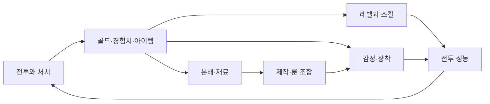

# 시스템·경제·확률·밸런스

## 1. 자원 흐름을 먼저 그린다

Machinations는 게임 내부 경제를 자원의 흐름으로 표현하고 시뮬레이션해 시스템의 동작을 살펴보는 틀이다. 자원 생성·저장·소모·전환의 관계를 드러내는 데 유용하다. 시뮬레이션 자체가 실제 재미를 입증하지는 않는다. [Dormans, 2011 원문](https://ojs.aaai.org/index.php/AIIDE/article/download/12477/12336/16005).

현재 게임에서 점검할 흐름을 단순화한 제안:



이 그림은 모든 상점·시장 경로를 감사한 완전한 모델이 아니다. 첫 경제 모델은 경로별 획득량과 소비량, 행동 시간, 제한 조건부터 기록한다.

`다음 잔액 = 현재 잔액 + 유입 − 유출`은 회계 항등식이다. 장기적으로 유입이 늘어난다는 사실만으로 인플레이션이라 부르지 않는다. 구매력·가격·의미 있는 소비처의 관계를 함께 봐야 한다. 싱글플레이 성장 게임에서는 자원 축적 자체가 의도된 경험일 수 있다.

## 2. 피드백 루프와 성장 곡선

전투력 증가→처치 증가→보상 증가→전투력 증가의 강화 루프는 성장을 빠르게 한다. 비용 증가·새로운 적 조건·자원 제약은 성장을 조절한다. 양의/음의 피드백은 좋음/나쁨의 뜻이 아니다.

| 모델 | 식의 예 | 설계상 의미와 한계 |
|---|---|---|
| 선형 비용 | `C(n)=a+bn` | 단계별 증가 폭이 일정. 수입도 같이 커지면 체감 부담은 달라짐. |
| 지수 비용 | `C(n)=a×r^n`, `r>1` | 후반 비용 증가가 큼. 수입 성장과 함께 분석해야 함. |
| 수확 체감 | `P(x)=Pmax×x/(k+x)` | 추가 투자 효과가 감소. 상한과 초반 기울기 모두 검토. |
| 계단형 해금 | 특정 조건에서 새 행동 추가 | 숫자 증가와 다른 성장. 해금 직전/직후의 난도 단절 확인. |

위 식들은 분석 예시이며 현재 게임의 구현이라고 주장하지 않는다. 체감 성장 속도는 `다음 목표 비용 / 단위 시간 순수입`으로 1차 추정할 수 있지만, 소비 선택·확률·해금·실패가 있는 경우 분포 기반 시뮬레이션으로 확장해야 한다.

## 3. 현재 경험치 규칙의 계산

확인한 [leveling.js](../../../src/systems/leveling.js)의 레벨 `l` 다음 단계 비용은 `50l`이다. 레벨 1, 경험치 0에서 레벨 L에 도달하는 누적 비용은 다음과 같다.

```text
Σ(50l), l=1..L−1 = 25L(L−1)
L=10이면 2,250 EXP
```

[idleCombat.js](../../../src/systems/idleCombat.js)의 `resolveIdleKill`은 처치 처리 한 번에 경험치 3을 지급한다. 따라서 **이 지급만 존재한다고 제한한 모델**에서는 750번으로 레벨 10에 도달한다. 실제 게임은 전투 정산 등 다른 보상이 있으므로 실제 소요 처치 수나 시간 예측이 아니다. `IDLE_COMBAT_TICK_MS=1000`만 보고 매초 반드시 처치한다고 가정하지도 않는다.

개발 판단: 레벨 비용의 모양보다 첫 장비 변경, 첫 스킬, 첫 보스 준비가 어느 경험 구간에 놓이는지를 먼저 측정한다.

## 4. 희귀 보상: 평균과 보장은 다르다

[dropTable.js](../../../src/data/dropTable.js)의 기본 가중치 합은 100이며 unique는 0.5다. 따라서 기본 등급 추첨에서 고유 등급의 확률은 0.005다. [items.js](../../../src/systems/items.js)는 명시적 `options.grade`가 있으면 이 추첨을 건너뛴다. 아래 계산은 **고정 확률·독립 추첨·천장 없음·기본 등급 추첨만**을 가정한다.

```text
첫 성공까지 추첨 횟수 기대값: E[N] = 1/p
n회 안에 적어도 한 번 성공: P(N≤n) = 1−(1−p)^n
q 비율이 한 번 이상 얻는 최소 횟수: ceil(log(1−q)/log(1−p))
```

기하분포는 첫 성공 전 실패 횟수 또는 첫 성공까지 전체 횟수로 정의할 수 있다. 여기서는 전체 횟수 N을 사용한다. NIST 문서는 실패 횟수 기준을 사용하므로 한 번의 차이를 구별한다. [NIST 기하분포 자료](https://www.itl.nist.gov/div898/software/dataplot/refman2/ch8/geoppf.pdf).

| 지표 | p=0.005일 때 |
|---|---:|
| 첫 고유 등급까지 평균 추첨 수 | 200회 |
| 누적 획득 확률 50%에 처음 도달 | 139회 |
| 누적 획득 확률 90%에 처음 도달 | 460회 |
| 누적 획득 확률 95%에 처음 도달 | 598회 |
| 200회 동안 한 번도 못 얻을 확률 | 약 36.70% |

이 결과는 게임 규칙에서 산출한 자체 계산이며 플레이어 로그 통계가 아니다. “200회 평균”을 “200회 보장”으로 표시해서는 안 된다. 특정 슬롯·옵션까지 요구하면 목표 확률은 달라진다.

천장이나 누적 확률을 도입하는 실험에서는 새 확률열 `p_i`에 대해 `P(첫 n회 모두 실패)=Π(1−p_i)`로 다시 계산한다. 기존 평균식을 그대로 사용하지 않는다. 제작·교환 같은 확정 경로는 랜덤 획득과 별도로 목표 도달 시간을 비교한다. 여기서는 천장 도입을 확정하지 않는다.

## 5. 전투 수치 모델과 한계

분석용 1차 모델:

```text
평균 명중 피해 = 기본 피해 × [1 + 치명타 확률 × (치명타 배율−1)]
평균 DPS ≈ 평균 명중 피해 × 초당 공격 수 × 명중 확률
처치 시간 TTK ≈ 적 HP / 평균 DPS
```

이는 치명타/명중의 모델 조건을 가정한 자체 계산 틀이다. 현재 전투 공식을 그대로 옮긴 것이 아니다. 실제로는 방어 계산 순서, 공격 예열, 오버킬, 대상 변경, 회복, 무적, 광역 범위 때문에 달라진다. 순간 폭발 피해와 지속 피해도 평균 DPS 하나로 비교하지 않는다.

방어력은 표기 숫자보다 적 공격 조건에서 생존에 주는 변화를 봐야 한다. 유효 체력 `HP/(1−피해감소율)` 역시 일정 비율 감소만 있을 때의 단순 모델이다. 고정 피해 차감·최소 피해 규칙이 있으면 그대로 적용할 수 없다.

## 6. 빌드 밸런스와 자동 추천

공격 1과 방어 1을 더할 수 있다는 것이 두 값의 효용이 같다는 뜻은 아니다. 전투 목표·적 구성·세트 임계점·회복 조건에 따라 장비 가치가 달라진다.

현재 [autoEquip.js](../../../src/systems/autoEquip.js)는 `statBonus` 합계로 같은 슬롯을 비교한다. [effectiveStats.js](../../../src/systems/effectiveStats.js)는 세트 개수, 고유 효과, 룬워드, 스킬 효과도 전투 수치에 반영한다. 따라서 “자동 장착이 전투 결과를 개선하는가”는 합계 비교만으로 증명되지 않는다. 실제로 잘못된 선택이 얼마나 발생하는지는 별도 실험이 필요하다.

추천 실험: 같은 초기 상태·적 조건에서 현재 장비와 후보 장비를 비교한다. 클리어율, 처치 시간, 남은 체력, 플레이어가 의도한 빌드 보존을 각각 본다. 하나의 가중 점수로 합칠 경우 가중치의 목적과 한계를 공개하고 수동 고정 기능과 함께 검토한다.

## 7. 시뮬레이션 설계

1. 모델 경계를 정한다: 전투 한 번인지, 제작 포함 성장인지, 방치 진행인지.
2. 입력을 고정한다: 게임 버전, 초기 상태, 설정, 난수 생성기/시드, 시간 처리.
3. 평균적 플레이 하나 대신 저투자·공격형·생존형·특정 제작 목표 등의 정책을 정의한다.
4. 평균·중앙값·상위 소요 시간·실패율·미도달 비율을 함께 기록한다.
5. 매개변수를 한 번에 무작정 바꾸지 않고 민감도 분석으로 결과를 크게 바꾸는 변수를 찾는다.
6. 구현과 모델의 차이를 실제 실행 표본으로 확인한 뒤 플레이테스트로 해석을 검증한다.

고정 시드는 재현에 필요하지만 시드 하나는 분포를 대표하지 않는다. A/B 시뮬레이션에서 같은 시드를 쓰더라도 두 정책이 난수를 소비하는 순서가 달라지면 동일 상황 비교가 깨질 수 있다. 적 생성·드롭·치명타 스트림을 분리하는 방법을 검토한다.

계산 재현은 [calculate-examples.py](calculate-examples.py), 결과는 [calculations.json](calculations.json)에 저장한다. 이 계산은 전체 게임 시뮬레이션이 아니다.
