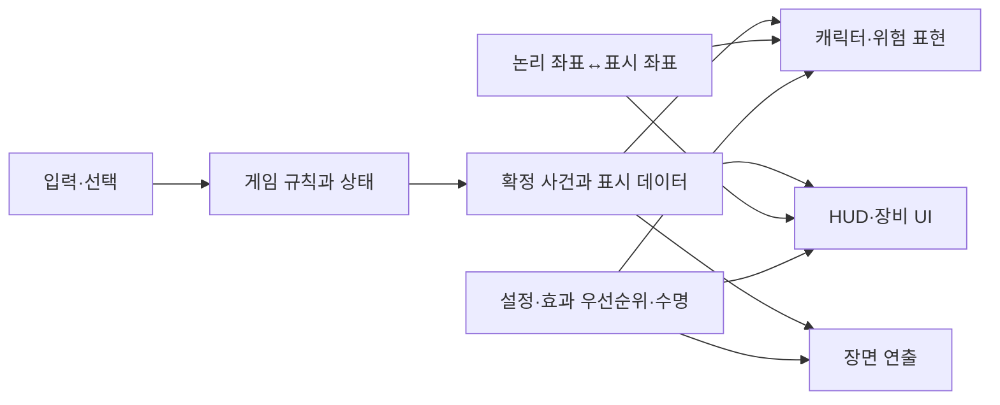

# 설계 변경을 포함한 시각 경험 재설계 가능성 분석

## 1. 판단: 가능하며, 화면·표현 중심의 재설계를 권장

현재 Phaser+DOM 구조에서 **엔진 교체 없이 화면 구성, 행동 아트, 위험 문법, 준비→전투→결과 흐름을 크게 바꾸는 재설계가 가능**하다. 다만 시각적 완성도 향상을 확정한 것은 아니며 대표 구간을 제작해 검증해야 한다. “가능”은 코드 구조상 실현 경로가 있다는 판단이다.

권장 범위는 현재 픽셀 회랑 탐험·자동 공격·장비 성장의 정체성을 유지하면서 표현과 선택 흐름을 재구성하는 것이다. 필요하면 적 역할과 전투 페이싱도 후속 단계에서 변경한다. 모든 조사 효과를 동시에 넣는 방향은 채택하지 않는다.

## 2. 대안 비교

| 안 | 범위 | 기대 변화 | 비용·위험 | 판단 |
|---|---|---|---|---|
| A 부분 개선 | 현 레이아웃 유지, 대비·아이콘·작은 효과 수정 | 읽기 개선, 빠른 검증 | 낮음~중간. 단일 포즈·좁은 데스크톱 화면 구조는 남음 | 작은 출시 단위로 유효 |
| B 화면·표현 재설계 | 반응형 화면 역할, 행동 프레임, 위험 문법, 장비 비교, 짧은 연출 | 플레이 화면·캐릭터·선택 경험의 변화 폭이 큼 | 중간~높음. 아트와 UI 수명, 좌표 구조 정리 필요 | **권장** |
| C 장르·엔진 전환 | 실시간 3D/쿼터뷰, 자유 카메라, 새 맵·전투 | 시각 언어 전면 변경 | 매우 높음. 리그·조명·카메라·밸런스·저장 이행까지 확대 | 현 근거로 권장하지 않음 |

B안은 보상 수치나 전투 공간을 무조건 그대로 고정한다는 뜻이 아니다. 먼저 표현만 바꾼 비교 기준을 만든 뒤 규칙 변화가 필요한 부분을 별도 실험해 영향을 구분한다.

## 3. 현재 구조에서 바꿔야 할 부분

| 현재 근거 | 제약 | B안의 변경 |
|---|---|---|
| CSS `#app max-width:520px` | 넓은 화면에서도 세로 앱만 사용 | 탐험/관리 화면을 넓은 레이아웃에 대응 |
| `art.js`의 단일 소형 패턴 텍스처 | bob·tint·방향 반전이 동작 표현의 중심 | 행동별 프레임과 역할별 실루엣 |
| `drawRoom` 단일 Graphics | 깊이·지역 변화를 층별로 다루기 어려움 | 원경·벽·바닥·장식 레이어 분리 |
| IdleScene의 canvas pointerup으로 전투 진입 | 관찰·장면 조작과 출전 의도가 겹칠 수 있음 | 명시적 출전 버튼과 준비 요약 |
| 하단 관리 패널 중심 | 전투/제작/설정의 정보 역할 차이가 작음 | 과업별 관리 화면과 전투 HUD 분리 |
| `drawEffects`에서 의미·형태가 직접 결합 | 색/범위 변경의 공통 기준 부족 | 효과 의미와 판정 정보를 담는 표현 정의 |
| 표시 크기에 따라 arena 좌표·범위 조정 | 화면 확대가 전투 거리/밀도와 연결 | 재설계 대표안에서는 전투 폭을 최대 520px로 유지하고 탐험/관리 화면만 넓혔다. 논리 좌표와 확대 viewport 분리는 전투 공간을 넓히기로 결정할 때 별도 과제로 둔다. |
| 장비 합계 자동 비교 | 세트·룬 교환 관계 설명 부족 | 전후 비교와 자동 교체 보호 |

관련 파일: [main](../../../src/main.js), [style](../../../src/style.css), [art](../../../src/scenes/art.js), [IdleScene](../../../src/scenes/IdleScene.js), [CombatScene](../../../src/scenes/CombatScene.js), [arena](../../../src/systems/arena.js), [BottomPanel](../../../src/ui/BottomPanel.js).

## 4. 목표 시각 경험

프로젝트용 제안 문장: **어두운 회랑 속 캐릭터와 위협은 선명하게 읽히고, 행동의 준비와 결과가 이어지며, 획득한 장비가 다음 준비에 어떤 변화를 주는지 보인다.**

네 가지 기준을 함께 잡는다.

1. **읽기:** 캐릭터·위험·현재 상태가 장식보다 우선한다.
2. **행동:** 이동·준비·타격·피격의 자세가 구별된다.
3. **공간:** 반복 벽돌 한 층을 넘어 원경과 접지·조명으로 장소감을 만든다.
4. **연속성:** 획득→보관→비교→장착→전투 결과가 연결된다.

이는 새 게임 이름이나 세계관 확정이 아니다. 팔레트는 기존 청록 계열 배경과 따뜻한 주인공·보상색을 출발점으로 시험한다. UI 문자까지 픽셀화할 필요는 없으며 한국어 본문은 읽기 쉬운 서체를 유지한다.

## 5. 화면 구조 재설계

### 탐험/관리 화면

넓은 화면은 회랑 장면과 장비·성장 패널을 나란히 배치한다. 좁은 화면은 장면 아래 간결한 목표·출전 영역을 두고 관리 화면을 펼쳐 사용한다. 화면이 좁아졌다는 이유로 긴 장비 설명을 작은 글자로 압축하지 않는다.

```text
넓은 화면 — 구성 예시, 픽셀 확정안 아님
┌─────────────────────────────────────┐
│ 지역·진행                      재화 │
├──────────────────────┬──────────────┤
│                      │ 장비/성장    │
│ 탐험 장면            │ 선택 항목    │
│ 캐릭터·원경·방향     │ 전후 비교    │
│                      │ 변경 효과    │
├──────────────────────┤              │
│ 다음 목표 / 출전     │              │
└──────────────────────┴──────────────┘
```

출전 버튼은 일반 생존과 보스를 구별하고, 준비 요약에는 장착 세트·오라·저주처럼 중요한 선택만 표시한다. 첫 플레이에서는 모든 제작·거래 기능을 동시에 설명하기보다 현재 목표와 연결해 소개한다. 기능을 삭제하는 것과 노출 순서를 바꾸는 것을 구별한다.

### 전투 화면

관리 패널은 전투 중 숨기고 핵심 HUD만 남기는 기존 방향을 유지한다. HP·상태·보스 정보·위험 예고가 서로 가리지 않도록 안전 영역을 둔다. 배경은 장식 층, 판정 표시는 월드 층, HUD는 별도 층으로 구분한다.

**중요한 선택:** 데스크톱 화면을 넓혀 월드 폭까지 그대로 늘리면 적 이동 거리·탄막 회피 공간·스폰 밀도가 달라진다. 최초 B안은 기준 논리 전투 영역을 정하고 표시만 확대/배치하는 방식을 우선 비교한다. 남는 영역은 배경·전투 기록 등 비판정 정보에 쓰거나 여백으로 둔다. 어떤 기준 비율이 적절한지는 모바일·데스크톱 대표 장면에서 검증한다. 단순 520px 제한 제거만으로 완료 처리하지 않는다.

후속으로 넓은 전장 자체를 채택한다면 사거리·이동·스폰·난도를 별도 재조정하고 표현 변경과 다른 버전으로 비교한다. 논리 좌표 전환은 포인터 입력, 리사이즈, 저장된 위치, 위험 반경, HUD 비행 좌표까지 다뤄야 한다.

### 결과/장비 화면

결과는 큰 숫자와 장식만 보여주는 모달에서 “획득한 핵심 물품→현재 장비와 비교→다음 행동”으로 이어지게 한다. 자동 장착된 경우 잃고 얻은 효과를 설명한다. 스킵해도 결과와 보상은 동일하고 이후 목록에서 다시 확인할 수 있게 한다.

## 6. 캐릭터·적·전투 표현 재설계

### 캐릭터 아트

처음부터 모든 몬스터의 대형 시트를 만들지 않는다. 주인공과 대표 적 하나에 대기·이동·준비·공격·피격·퇴장 프레임을 제작한 대표 구간부터 평가한다. 16px 기반을 유지한 안과 더 큰 원화 해상도 안을 실제 표시 크기로 비교한다. 프레임 개수·해상도는 아트 테스트 뒤 확정한다.

몸 위치는 판정 모델을 따르고 별도 표시 루트에서 반동·스미어·소품을 합성한다. 발과 그림자는 지면 기준을 유지한다. 저속 포즈 운용을 쓰더라도 입력·물리·카메라 갱신률까지 낮추지 않는다.

### 적 역할

현재 일반 적은 형태와 속도 차이가 있으나 주로 플레이어를 향해 접근한다. 시각 변화만으로 충분하지 않다면 후속 범위로 추적형·예고 공격형·지원형처럼 행동 역할을 나누고 실루엣·공격 준비를 함께 설계할 수 있다. 새 역할은 재미를 바꿀 수 있지만 난도·경로·아트 비용도 늘어나므로 B안의 최초 필수 범위는 아니다.

### 위험 문법

폭발은 면적, 돌진은 방향과 통로, 탄막은 발사 방향, 저주는 지속 영향권을 전달한다. 모두 같은 원형 강조에 의존하지 않는다. 판정 오버레이와 비교해 플레이어 접촉 크기를 포함한 일관된 약속을 정한다. 외곽선·패턴·아이콘은 의미를 유지하고 색만으로 구별하지 않는다.

### 보스 소개

명시적 출전 후 짧은 준비 장면에서 실루엣·시선·이름·소리를 연결한다. 약한 줌이나 시차는 후보이며 필수 아님. 최초 소개와 재도전 버전을 구분하고 모션 감소/스킵 경로를 둔다. 장식 소개가 끝나기 전에 사용자가 대응할 수 없는 공격을 시작하지 않는다.

## 7. 필요한 기술 경계



규칙 시스템·저장·장비 정의는 가능한 부분을 재사용한다. 씬 코드에 흩어진 효과와 DOM 전체 교체 경로는 필요 범위에서 분리한다. 새로운 모듈명이나 프레임워크 도입부터 정하지 않고 사건 계약·좌표·수명·포커스 책임부터 명시한다.

설정이나 장비 잠금 필드를 추가하면 기본값 병합과 이전 저장 호환을 함께 설계한다. 저장 키를 바꿔 기존 진행을 초기화하는 방식은 재설계의 기본 전제가 아니다. 자동 장착 정책을 바꾸어도 기존 장비를 강제로 재평가·교체하지 않는 이행안을 검토한다.

## 8. 검증 가능한 제작 단계

| 단계 | 산출물 | 통과 판단 |
|---|---|---|
| 1 방향 정리 | 탐험·전투·장비 3개 화면 구성, 스타일 기준 | 각 화면의 주요 질문과 시선 우선순위 명확 |
| 2 대표 구간 | 주인공+적 하나+보스 예고 하나+장착 한 번 | 원본 대비 행동·위험·선택 이해 개선 |
| 3 구조 검증 | 논리 좌표, 입력, 연출 취소, UI 포커스 | 여러 크기와 스킵에서 결과/판정 일관 |
| 4 콘텐츠 확장 | 적/장비/배경에 같은 기준 적용 | 역할 구분·스타일 유지, 제작 비용 감당 가능 |
| 5 통합 검증 | 실제 기기·저장 이행·포털 포함 확인 | 성능·가독성·진행 회귀 확인 후 배포 판단 |

대표 구간에는 기존 규칙을 유지한 버전과 제안 표현을 비교할 수 있어야 한다. 정지 이미지만 좋아지고 공격 정보가 어려워지면 채택하지 않는다. 구현 난도가 높거나 개선이 관찰되지 않는 효과는 줄인다.

## 9. 가능성과 아직 확인하지 못한 것

**구조상 가능:** Phaser 내 프레임 아트, 레이어 배경, DOM 관리 화면, 사건 기반 피드백을 점진적으로 교체할 수 있다. 엔진을 바꾸어야만 구현할 기능이 핵심 권장안에 없다.

**선행 확인 필요:** 새 아트의 품질과 제작 속도, 목표 실제 모바일 성능, 논리 전투 비율, 사용자 이해 개선, 저장/포커스 호환. 이 항목을 확인하기 전 일정이나 개선율을 확정하지 않는다.

최종 권장은 **B안으로 재설계하되 대표 구간에서 시각·플레이 개선을 입증한 뒤 확장**하는 것이다. 이번 산출물은 가능성 분석과 제안 설계이며 실제 프로젝트 설계를 교체하거나 구현·배포한 결과는 아니다.
