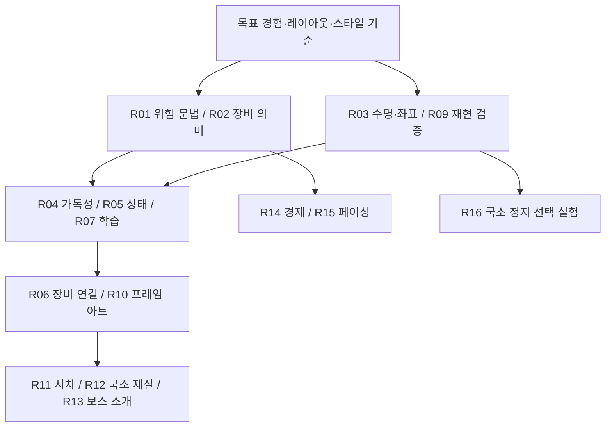

# 통합 적용안 16개와 실행 순서

비용은 현재 소스에 대한 상대 판단이다. 낮음은 한정된 표현/문구 변경, 중간은 여러 상태·아트·UI 연동, 높음은 구조·콘텐츠·밸런스가 함께 바뀌는 작업이다. 아트 제작 역량과 대상 기기 측정 전에는 일수를 확정하지 않는다.

| ID | 적용안 | 우선/비용 | 최소 범위 | 완료 조건 |
|---|---|---|---|---|
| R01 | 위험·저주·오라 문법 | P0/중간 | 효과 정의에 의미·범위·예고·판정을 연결, 저주/탄막/폭발/돌진 구별 | 디버그 판정 비교와 플레이어 의미 해석 확인 |
| R02 | 장비 교체의 설명·보호 | P0/중간 | 전후 수치와 잃는 세트/룬 표시, 자동 교체 보호 정책 | 확인 사례에서 교환 관계 설명, 수동 선택 보존 |
| R03 | 공통 모션·수명·좌표 정책 | P0/중간 | 모션/섬광 분리 검토, 월드→화면 변환, 취소·복원 | 감소/resize/스킵/씬 종료에서 상태·표현 정상 |
| R04 | 배경 감산·캐릭터 분리 | P1/낮음~중간 | 전투 바닥 단순화, 실루엣·접지·문자 대비 | 원본 대비 식별 개선, 분위기 저하 여부 확인 |
| R05 | 체력·상태·보상 정보 계층 | P1/중간 | 현재/이력 구분, 상태 아이콘+문구, 중요 알림 우선 | 상태 인식 오류와 가림 감소, 작은 화면 유지 |
| R06 | 장비 비교와 위치 연결 | P1/중간~높음 | 같은 ID의 장착 이동, 포커스 보존, 변경 효과 요약 | 연속 조작·갱신에 중복/포커스 상실 없음 |
| R07 | 첫 성장·출전 준비 흐름 | P1/중간 | 첫 획득→비교→장착→효과 확인, 명시적 출전 | 사용자가 선택 이유와 다음 목표를 설명 |
| R08 | 효과 우선순위와 합산 | P1/중간 | 필수 예고 우선, 숫자 합산, 중요 타격 소수 입자 | 밀집 전투에서도 예고·HP 식별, 효과 수 안정 |
| R09 | 재현 장면·성능·상태 검증 기반 | P1/중간 | 고정 상태/입력, 결과 단일 처리, 대표 기기 측정 | 정상/취소 같은 결과, 느린 프레임과 수명 기록 |
| R10 | 행동 프레임·표시 계층 | P1/중간~높음 | 주인공+대표 적의 이동/준비/타격/피격, 시각 자식 분리 | 역할·행동 식별, 판정 위치 불변, 픽셀 안정 |
| R11 | 배경 레이어와 탐험 깊이 | P2/중간 | 원경/벽/전투 바닥 분리, 제한 시차 | 반복 이음매·빈틈·resize 잔존 없음, 감소 대안 |
| R12 | 픽셀 아트 스타일 규칙 | P1 기준/P2 확장·중간 | 팔레트·명암·윤곽·효과 형태 기준, 룬 국소 순환 | 자산 간 일관성과 위험색 식별 동시 유지 |
| R13 | 짧은 보스 소개·결과 연결 | P2/중간 | 시선/핵심 포즈/소리 연결, 선택적 약한 줌 | 스킵 가능, 전투 준비 전 공격 없음, 카메라 복원 |
| R14 | 성장·보상 분포 모델 | P2/중간 | 모든 보상 경로와 목표 도달 분포 확인 | 평균·장기 미획득·확정 경로를 함께 설명 |
| R15 | 전투 강약과 적 역할 | P2/높음 | 대표 적 역할 차이와 구간 긴장/정리 시간 실험 | 기존 대비 체감 다양성, 불공정·성능 악화 없음 |
| R16 | 중요 타격의 국소 정지 | P3/중간 | 보스/강한 타격의 표시만 짧게 정지하는 비교안 | 입력/타이머 혼란 없이 인식 개선될 때만 채택 |

## 의존성과 단계

재설계를 채택할 경우 R04~R07은 현재 레이아웃에 임시로 덧붙이기보다 [재설계안](redesign-feasibility.md)의 대표 화면에서 먼저 검증한다. R12의 스타일 기준은 초기에 정하고 팔레트 순환 같은 장식은 뒤로 미룬다.

## 범위에 넣지 않을 요소

현재 단계에서는 물 시뮬레이션, 실시간 파괴, 풀 3D 카툰 엔진, 고급 IK/관성 전이, 영화식 오빗·크레인, 상시 심도 흐림·전면 속도선, 전역 슬로모션을 핵심 범위에 넣지 않는다. 콘텐츠·판정·아트 비용이 커지고 현재 한 화면 자동 공격 게임의 주요 문제와 직접 연결되지 않는다.

기술적으로 구현 가능하다는 사실과 현재 프로젝트에 가치가 있다는 판단은 다르다. 보류 항목은 영구 배제가 아니라 해당 지역·기믹·규칙의 필요가 생기면 다시 평가한다.

## 공통 완료 기준

각 변경은 구현 존재, 규칙 일치, 시각 연속성, 사용자 이해, 성능/접근성의 근거를 구분해 기록한다. 모든 항목에 대규모 사용자 실험을 요구하는 것은 아니지만 실제 이해·만족을 주장하려면 해당 근거가 필요하다. 수치 계산·스크린샷·단위 테스트를 서로 대신하지 않는다.
